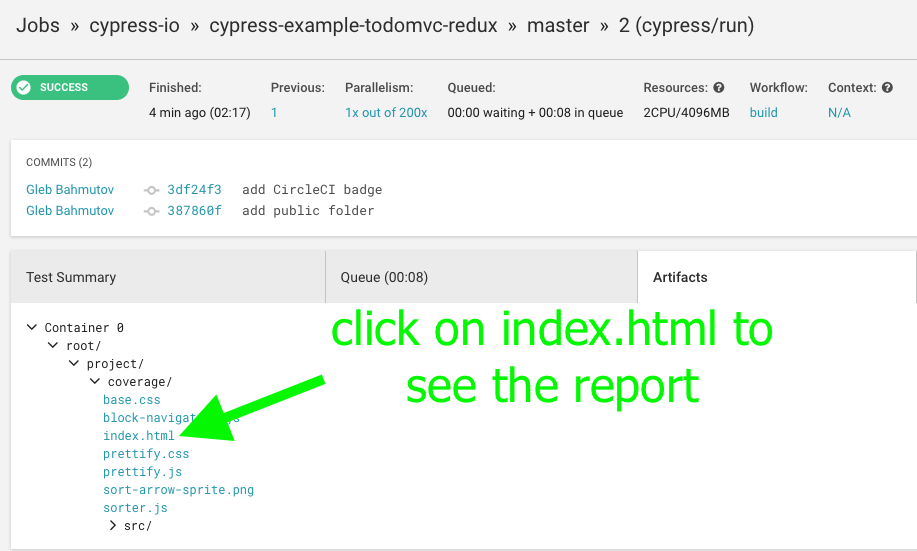
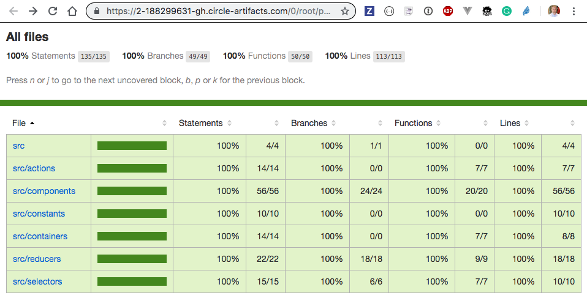

# cypress-example-todomvc-redux [](https://circleci.com/gh/cypress-io/cypress-example-todomvc-redux) [![renovate-app badge][renovate-badge]][renovate-app] [](https://coveralls.io/github/cypress-io/cypress-example-todomvc-redux?branch=master)
> TodoMVC example with full e2e test code coverage

This example is a fork of the official [Redux TodoMVC example](https://github.com/reduxjs/redux/tree/master/examples/todomvc) with a set of [Cypress.io](https://www.cypress.io) end-to-end tests. The tests run instrumented application code and the code coverage is saved automatically using [cypress-istanbul](https://github.com/cypress-io/cypress-istanbul) plugin.

## GitLab CI mirror

[](https://gitlab.com/cypress-io/cypress-example-todomvc-redux/commits/master) [](https://gitlab.com/cypress-io/cypress-example-todomvc-redux/commits/master)

Deployed coverage report is at [https://cypress-io.gitlab.io/cypress-example-todomvc-redux/](https://cypress-io.gitlab.io/cypress-example-todomvc-redux/), generated following this [GitLab coverage guide](https://about.gitlab.com/blog/2016/11/03/publish-code-coverage-report-with-gitlab-pages/).

## Install and use

Because this project uses [Parcel bundler](https://parceljs.org) to serve the web application, it requires Node v12+.

```shell
yarn
yarn test
```

The full code coverage HTML report will be saved in `coverage`. You can also see text summary by running

```shell
yarn report:coverage:text
```

## How it works

Application is served by [Parcel bundler](https://parceljs.org) that uses [.babelrc](.babelrc) file to load [babel-plugin-istanbul](https://github.com/istanbuljs/babel-plugin-istanbul) plugin. This plugin instruments the application source code. During tests [@cypress/code-coverage](https://github.com/cypress-io/code-coverage) plugin merges and saves application code coverage information, rendering the full HTML report at the end.

Unit tests like [cypress/integration/selectors-spec.js](cypress/integration/selectors-spec.js) that reach into hard to test code paths are also instrumented using the same [.babelrc](.babelrc) file, and this additional code coverage is automatically added to the application code coverage.

### .babelrc

To always instrument the code using Babel and [babel-plugin-istanbul](https://github.com/istanbuljs/babel-plugin-istanbul) one can simply use the `istanbul` plugin

```
{
  "plugins": ["istanbul"]
}
```

But this will have instrumented code in the production bundle. To only instrument the code during tests, add the plugin to the `test` environment and serve with `NODE_ENV=test`

```
{
  "env": {
    "test": {
      "plugins": ["istanbul"]
    }
  }
}
```

Parceljs note: there are some issues with environment-specific plugins, see [PR #2840](https://github.com/parcel-bundler/parcel/pull/2840).

### More info

- [Cypress code coverage guide](https://on.cypress.io/code-coverage)
- watch [Code coverage webinar](https://youtu.be/C8g5X4vCZJA), [slides](https://cypress.slides.com/cypress-io/complete-code-coverage-with-cypress)

There are also separate blog posts

- [Code Coverage for End-to-end Tests](https://glebbahmutov.com/blog/code-coverage-for-e2e-tests/)
- [Code Coverage by Parcel Bundler](https://glebbahmutov.com/blog/code-coverage-by-parcel/)
- [Combined End-to-end and Unit Test Coverage](https://glebbahmutov.com/blog/combined-end-to-end-and-unit-test-coverage/)

## CircleCI

Code coverage is saved on CircleCI as a test artifact. You can view the full report there by clicking on the "Artifacts" tab and then on "index.html"



The report is a static site, you can drill into each folder to see individual source files. This project should be 100% covered by Cypress tests:



## Warning

Full code coverage is not the guarantee of exceptional quality. For example, the application might NOT work on mobile viewport, while working perfectly on desktop with 100% code coverage. See [cypress/integration/viewports-spec.js](cypress/integration/viewports-spec.js) for how to test main user stories across several viewports.

## Smoke tests

As an example, there is a reusable smoke test [cypress/integration/smoke.js](cypress/integration/smoke.js) that goes through the most important parts of the app, covering 84% of the source code. This test can be reused from other tests, for example from [cypress/integration/smoke-spec.js](cypress/integration/smoke-spec.js), that can be executed after deploy for example by using [cypress-smoke.json](cypress-smoke.json) config file

```shell
npx cypress run --config-file cypress-smoke.json
```

## Component tests

Unit (individual JS functions) and component tests (React components) can be run without any server. There is no need to set anything up, this project works right out of the box without any additional steps, except you need to add `import 'cypress-react-unit-test'` to your Cypress [`supportFile`](https://on.cypress.io/configuration#Folders-Files).

```shell
$ npx cypress open --config-file cypress-unit.json
```

These tests leave alongside Jest tests in [src](src) folder and are named `*.cy-spec.js`. Implemented using [cypress-react-unit-test](https://github.com/bahmutov/cypress-react-unit-test).

## License

This project is licensed under the terms of the [MIT license](/LICENSE.md).

[renovate-badge]: https://img.shields.io/badge/renovate-app-blue.svg
[renovate-app]: https://renovateapp.com/
